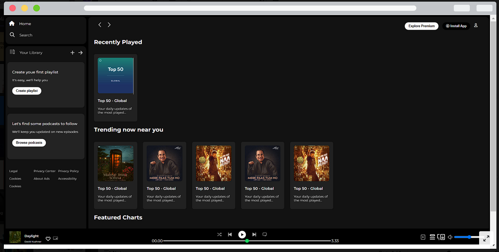

# Spotify Clone Frontend Design

## Overview

This project is a frontend clone of the popular music streaming service Spotify. It aims to replicate the user interface and design of the Spotify web application using HTML and CSS.

## Features

- **Header Navigation:** Replicates the header section of the Spotify web app, including the Spotify logo, search bar, and user profile menu.
- **Sidebar Menu:** Mimics the sidebar menu that allows users to navigate between different sections such as Home, Browse, Radio, and Your Library.
- **Featured Playlists:** Displays a selection of featured playlists with album artwork, title, and artist information.
- **Recently Played:** Shows recently played tracks with album artwork and track information.
- **Footer:** Includes a footer section with links to various pages such as About, Jobs, For the Record, and Help.

## Usage

1. Clone the repository using the following command:
    ```
    git clone https://github.com/Gandhiprajwal/Spotify-Clone.git
    ```

2. Navigate to the cloned directory:
    ```
    cd Spotify-Clone
    ```

3. Open the `index.html` file in your web browser.

4. Install the Live Server extension for your code editor (if not already installed).

5. Start the Live Server to view the Spotify clone design in your browser.

## Preview



## Conclusion

This Spotify clone frontend design provides a close representation of the Spotify web application's user interface using HTML and CSS. While it lacks functionality such as music playback and user authentication, it serves as a visual reference for recreating Spotify's design in web development projects.
